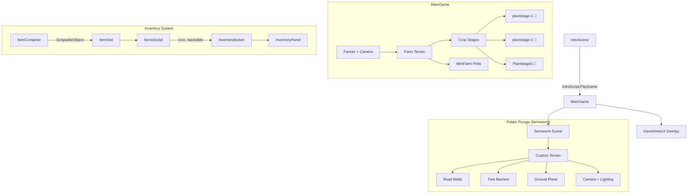
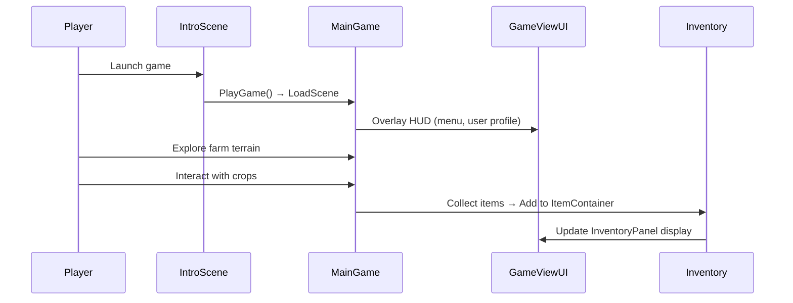

# Farming Simulator 🌾

 

*A 3D farming simulation game built in Unity — grow crops, manage inventory, and explore a handcrafted farm world with dynamic terrain, weather, and an inventory system.*

---

## Overview

A collaborative Unity farming simulation game where players manage a virtual farm. The game features a handcrafted 3D terrain, crop growth stages (saplings → medium → full corn), an item-based inventory system, weather effects (rain), and multiple game scenes including an intro, main farm, UI overlay, and the **Polam Purugu (Farm Worm)** terrain scene.

Built as a team project using **Unity Collaborate** for version control across multiple developers.

---

## My Contribution — Polam Purugu (పొలం పురుగు)

**"Polam Purugu"** (Telugu: *Farm Worm*) — I designed and built the `farmworm` scene, a dedicated terrain environment within the farming world:

- **Custom terrain sculpting** with road walls, tree barriers, and landscape boundaries
- **Camera system** for the farmworm exploration area
- **Environmental layout** — directional lighting, subtree placement, ground planes
- **Integration** with the main game's scene system alongside `MainGame`, `IntroScene`, and `GameViewUI`

---

## Architecture

---

## Game Flow

---

## Scripts

| Script | Responsibility |
|--------|---------------|
| `IntroScript.cs` | Loads the MainGame scene from the intro screen |
| `ItemsScript.cs` | ScriptableObject defining item properties (name, icon, stackable) |
| `ItemContainer.cs` | ScriptableObject managing a list of ItemSlots with add/remove logic |
| `InventoryButton.cs` | UI button for each inventory slot — displays icon and count |
| `InventoryPanel.cs` | Renders the full inventory grid from the ItemContainer data |

---

## Scenes

| Scene | Description |
|-------|-------------|
| `IntroScene` | Title screen with Play button |
| `MainGame` | Primary gameplay — farm terrain, crop stages, farmer movement |
| `GameViewUI` | HUD overlay — inventory, menu button, user profile |
| `farmworm` | **Polam Purugu** — custom terrain environment with roads and barriers |
| `test` | Development testing scene |

---

## 3D Assets

The project includes a rich set of 3D models and environmental assets:

- **Terrain** — Custom Unity terrain with mountain ranges and ground textures
- **Vegetation** — Corn crops, saplings (small/medium), trees (laxer tree package)
- **Structures** — House, walls, well, wooden props
- **Weather** — RainMaker particle system
- **Character** — Farmer character model
- **Tools** — Sickle for harvesting
- **Environment** — Skybox, ground texture packs

---

## Getting Started

1. Clone the repo
2. Open in **Unity 2019.4.x** (LTS)
3. Open `Assets/Scenes/IntroScene.unity`
4. Hit **Play** — click the play button on the intro screen to enter the farm

---

Built collaboratively · Polam Purugu scene by [Akhila Susarla](https://github.com/Akhila-Susarla)

